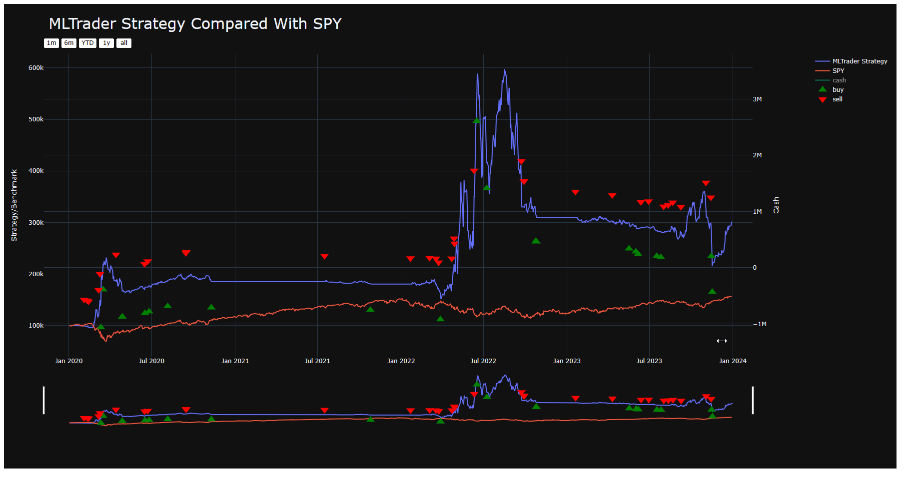

# Algorithmic Trading with Python: MLTrader Documentation

## Introduction

This documentation provides an overview of the MLTrader system, its components, and instructions for setup and execution.

## System Overview

The MLTrader system is composed of two main components:

1. **Sentiment Analysis Module (`finbert_utils.py`):** Utilizes the FinBERT model to analyze market news sentiment, categorizing it into positive, negative, or neutral. This analysis informs the trading decisions of the algorithm.
2. **Trading Algorithm (`tradingbot.py`):** Implements the trading strategy based on sentiment analysis. It interfaces with the Alpaca API for trade execution in a paper trading environment, allowing for risk-free experimentation.

## Requirements

- Python 3.6+
- Packages: `transformers`, `torch`, `lumibot`, `alpaca-trade-api`, among others listed in `requirements.txt`.

## Setup Instructions

1. **Install Dependencies:** Ensure Python 3.6+ is installed. Install required Python packages using `pip install -r requirements.txt`.
2. **API Keys:** Sign up for Alpaca and obtain your API key and secret. Update `tradingbot.py` with your credentials.
3. **Run Sentiment Analysis:** Execute `python finbert_utils.py` to perform sentiment analysis on your chosen market news feed.
4. **Execute the Trading Bot:** Run `python tradingbot.py` to start the trading bot based on the sentiment analysis.

## Output

- **MLTrader Output:** The trading decisions and logs will be output to the console and saved to HTML files for detailed analysis.
- **Tearsheet Analysis:** Post-trade analysis is provided through a Tearsheet, summarizing the performance metrics of the trades executed by the bot.

## Output Region

A detailed log of each trade executed by the system.

A comprehensive performance analysis

## HTML Files

- **Trade Execution Log:** `MLTrader_2024-03-29_18-29-25_trades.html` - A detailed log of each trade executed by the system.
- **Tearsheet Analysis:** `Tearsheet (generated by QuantStats).html` - Provides a comprehensive performance analysis of the trading strategy over the selected period.

## Authors:

- Utkarsh Nigam (2128108)
- Hemang Mitra (2128074)
- Sourav Goel (2128094)

## Conclusion

The MLTrader system offers a sophisticated platform for algorithmic trading, leveraging machine learning for sentiment analysis. By following the setup instructions, users can deploy their trading strategies in a paper trading environment, enabling risk-free testing and refinement of algorithms.
